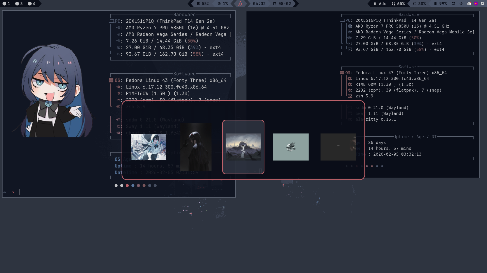
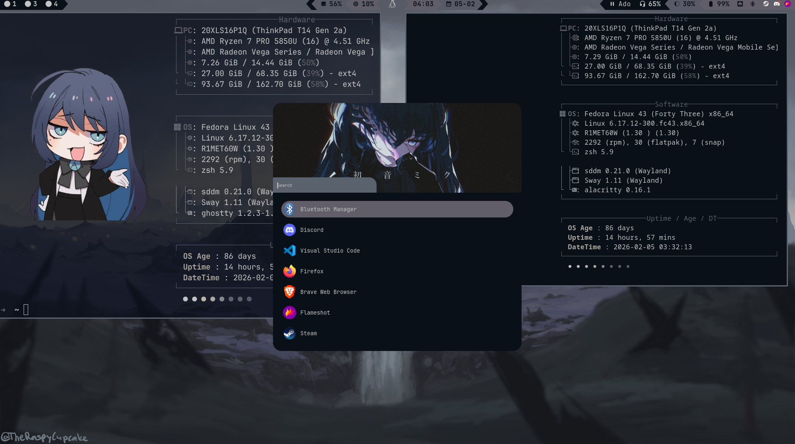
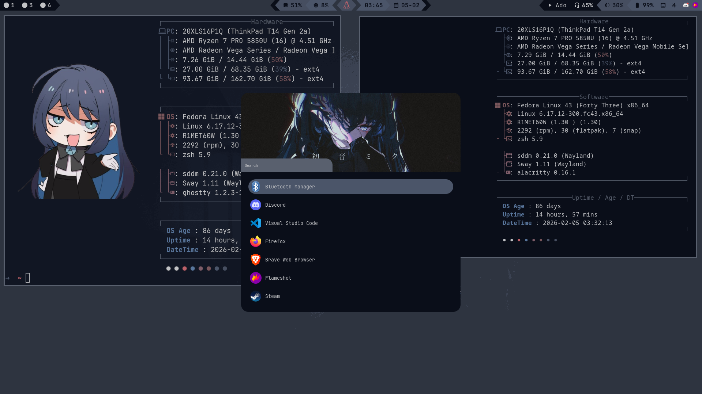
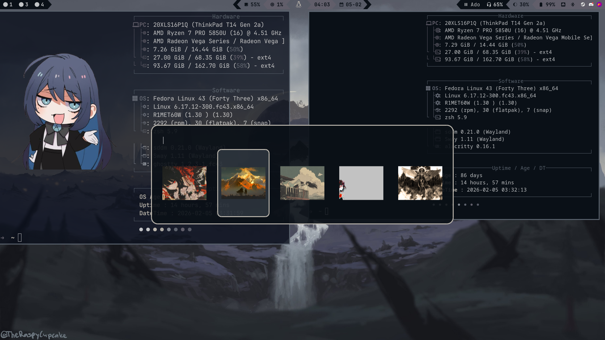
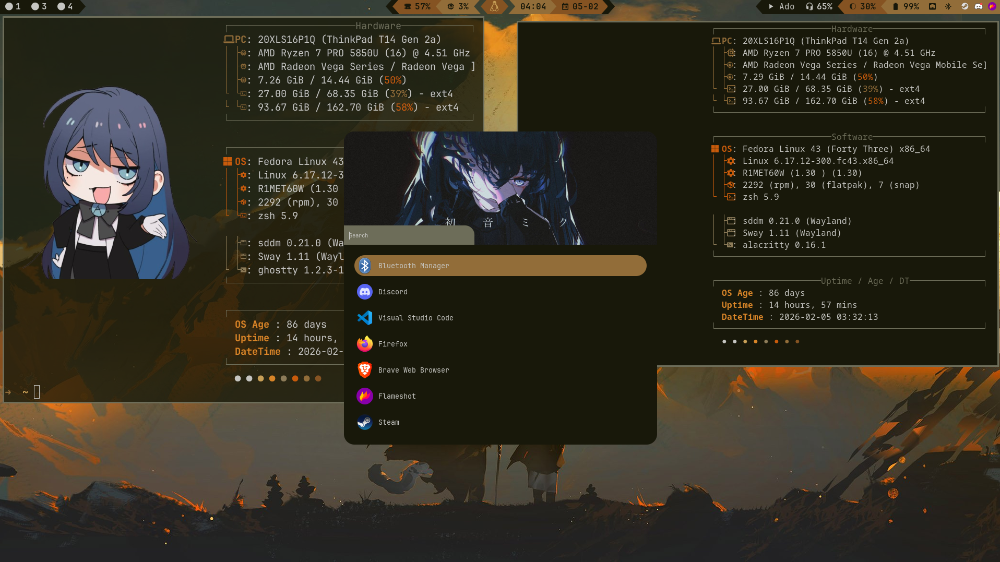

## Showcase
<p align="center">
    
  </p>
<details>
  <summary><b>📷 Click to expand screenshot gallery</b></summary>
  <p align="center">
     
     
    
  </p>
</details>

## Features
* **Live Previews:** Instant thumbnails via ImageMagick.
* **Auto-Theme:** Integrates with Pywal for system-wide colors.
* **Fast Search:** Rofi-powered.

## 🛠️ Installation

### Prerequisites

* `stow` (what I use to deploy the config files)

These are the apps used to make the scripts work, any other app is optional such as waybar for example.

* `rofi` (for the scripts to use as the wallpaper picker)
* `swww` (for wallpaper setting)
* `imagemagick` (for thumbnails)
* `pywal` (optional, for themes; default backend: haishoku)

#
#### `rofi`
[Instalation guide](https://github.com/davatorium/rofi/blob/next/INSTALL.md)
```sh
    dnf install rofi
```
#
#### `swww`
[Instalation guide](https://github.com/LGFae/swww?tab=readme-ov-file#build)

Follow the build portion of the official github.

#
#### `pywal & imagemagick`
[Instalation guide](https://github.com/dylanaraps/pywal/wiki/Installation)

Get python, pip and imagemagick
```sh
    sudo dnf install python3 python3-pip imagemagick
```
Install pywal
```sh
    pip3 install --user pywal
```
Check if installed correctly
```sh
    wal --version
```
## Setup
```sh
    git clone https://github.com/JorroIndieDev/dotfiles.git
```

```sh
    cd dotfiles
    stow */
```

Make the scritps for selecting the wallpapers executable 

```sh
    chmod +x .config/de-themes/*.sh
```

## 📖 Usage


```sh
    .config/de-themes/wallpaper-theme-selector.sh
```

The sway [keybinds](https://github.com/JorroIndieDev/dotfiles/blob/main/sway/.config/sway/conf.d/keybinds) for opening the wallpaper picker

`MOD+Shift+P` - Change the wallpaper and the colors \
`MOD+P`- Change just the wallpaper 

The [configuration](https://github.com/JorroIndieDev/dotfiles/blob/main/rofi/.config/rofi/wallpaper-grid.rasi) for the picker.


The active configuration for rofi is the `.config/rofi/custom-theme/custom-styles/custom-default.rasi` the other configs are by [adi1090x](https://github.com/adi1090x/rofi) I just altered parts of it.
## Take a look at these repos:

* [HYPRLUST](https://github.com/NischalDawadi/Hyprlust)
* [hellpaper](https://github.com/danihek/hellpaper)
* [hellwal](https://github.com/danihek/hellwal)
* [wallust](https://codeberg.org/explosion-mental/wallust)
* [adi1090x rofi configs](https://github.com/adi1090x/rofi)
* [base config](https://github.com/pirtur/sway-dots/)
